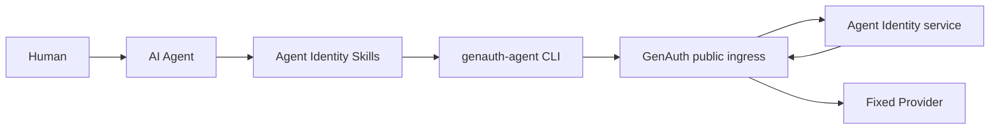

# Agent Identity Skills

**English** | [简体中文](./README.zh-CN.md)

Agent Identity operations for humans and AI agents. These Skills must be used
together with the `genauth-agent` CLI. They cover user-pool login, company
Agent creation and approval, Agent settings, Credentials, user authorization,
Tokens, and fixed Provider calls through GenAuth.

> Skills provide intent routing, orchestration, safety rules, and recovery.
> The CLI is the only execution layer. Installing the Skills without the CLI
> cannot perform any real Agent Identity operation.

[Quick start](#installation-and-quick-start) ·
[AI agent setup](#quick-start-for-ai-agents) ·
[End-to-end journey](#end-to-end-user-journey) ·
[Skill catalog](#skill-catalog) ·
[Authentication](#authentication-user-pools-and-role-profiles) ·
[Security](#security-boundaries-and-risk-notice) ·
[Development](#development-verification-and-publishing)

## What this repository provides

Agent Identity Skills translate a natural-language request into constrained
`genauth-agent` CLI operations. They determine who should act, which user pool
must be selected, which approvals and confirmations are required, and how to
resume safely after an interruption. The CLI validates parameters, manages
local profiles and operating-system keychain references, emits stable JSON,
and sends requests to GenAuth.



A Skill must never bypass the CLI to call an Agent Identity private endpoint,
a Provider host, a database, EAK Delegation, or Token Vault.

## Key capabilities

| Capability | Description |
| --- | --- |
| Identity and user pool | Tenant-administrator browser login only; the CLI discovers its OIDC client and selects a manageable pool after authentication |
| Role profiles | Separate named administrator profiles for owner/requester, approver, and authorization operations |
| Permission discovery | Resolve GenAuth DataPolicy definitions; Agent Identity stores snapshots only |
| Agent management | Create and manage company Agents, Capability drafts, lifecycle, and readiness |
| Approval | Submit frozen Capability or settings versions for a different administrator to decide |
| Agent settings | Configure explicit/silent policy, Token TTL, UserGrant TTL, Credential TTL, redirect URIs, and realtime decisions |
| Credential lifecycle | Create, rotate, and revoke Agent Credentials with secrets stored in the OS keychain |
| User authorization | Administrators target a user; explicit consent is completed by that user in the GenAuth browser |
| Token lifecycle | Agent Identity signs short-lived Agent Tokens; raw Tokens are hidden by default |
| Provider call | Obtain a Token in-process and call an approved fixed Provider route only through GenAuth |
| Revocation and diagnosis | Revoke a Credential, UserGrant, or Token JTI and diagnose each failure layer independently |

Only company-level Agents are supported. Personal Agents are out of scope.
Authorization policy is configured at Agent level; there is no user-pool-level
Agent policy in this version.

## How the CLI and Skills work together

A normal request crosses three layers:

1. A human tells an AI agent the desired outcome, such as “create an order
   Agent and request the `orders.read` permission.”
2. A Skill selects the acting profile, validates the user pool and permissions,
   enforces approval boundaries, requests human confirmation, and chooses the
   next CLI command.
3. The CLI uses the named profile and OS keychain, calls GenAuth, and returns a
   stable JSON envelope.

Humans may also run the CLI commands directly. The same role, approval,
authorization, and secret-handling rules still apply.

## Installation and quick start

### Requirements

- macOS arm64/x64, Linux arm64/x64, or Windows x64.
- Node.js and npm for the prebuilt CLI and Skill installer.
- A reachable GenAuth HTTPS origin. The CLI discovers its dedicated OIDC Client ID.
- Two different real identities when approval is required: an owner/requester
  and an approver.

### Step 1: install the CLI

Install the prebuilt CLI from npm:

```bash
npm install --global @eazo/genauth-agent-cli
genauth-agent version
genauth-agent --help
```

Do not install with `npm install --omit=optional`. The platform binary is
selected through an optional dependency.

Source developers may build the CLI from its source repository:

```bash
make install
genauth-agent version
```

The version output must include these contracts:

```json
{
  "api_version": "genauth-agent.cli/v1",
  "kind": "Version",
  "data": {
    "command_contract": "genauth-agent.commands/v2",
    "server_contract": "genauth-agent-identity-v1"
  }
}
```

An incompatible contract is a hard stop. Do not guess renamed commands or
response fields.

### Step 2: install the Skills

Install all Skills directly from the confirmed GitHub repository:

```bash
npx skills add EazoAI/Genauth-Agent-Skill -y -g
```

To inspect the available Skills without installing them:

```bash
npx skills add EazoAI/Genauth-Agent-Skill --list
```

To install from a local clone:

```bash
git clone https://github.com/EazoAI/Genauth-Agent-Skill.git
cd Genauth-Agent-Skill
npx skills add . -y -g
```

Verify the global installation:

```bash
npx skills list -g
```

The repository exposes 13 `agent-identity-*` Skills. Start a new AI agent
session after installation or update so Skill discovery is reloaded. Install
the complete repository: thin intent Skills depend on shared/domain Skills and
their reference files.

### Step 3: verify the local environment

```bash
genauth-agent version --output json --non-interactive
genauth-agent doctor --output json --non-interactive
```

`doctor` is read-only. It verifies the local profile, selected user pool,
operating-system secret store, and GenAuth reachability. It does not prove that
a specific Agent is runtime-ready.

## Quick start for AI agents

> Browser login, approval, and explicit-consent pages require a real human. An
> AI agent must not enter passwords, approve consent, or make a security choice
> on the human's behalf.

### 1. Verify setup

Start a fresh AI agent session and ask:

```text
Use the agent-identity-setup Skill. Verify the CLI version, command/server
contracts, installed Skills, profile, selected user pool, and OS keychain.
Perform read-only checks only.
```

### 2. Log in

Tenant-administrator login:

```text
Use the agent-identity-login Skill to log in as a tenant administrator through
GenAuth at GENAUTH_ORIGIN. Use profile agent-owner. Do not ask me for a Client
ID or user pool before opening the browser login.
```

The AI agent may open or return a GenAuth login URL. Login is complete only
after `auth status` confirms the expected identity and user pool.

### 3. Run the complete journey

```text
Use the agent-identity-user-journey Skill to complete this flow:
- create a company Agent with profile agent-owner;
- identifier: orders_agent;
- application ID: APPLICATION_ID;
- audience: https://api.example.com/orders;
- discover the DataPolicy for orders.read and let me confirm it;
- use profile agent-approver for Capability and settings approval;
- use explicit-only authorization and a 10-minute Token TTL;
- explicitly authorize target user TARGET_USER_ID through the GenAuth browser;
- call fixed Provider orders with GET /orders through GenAuth.

Return a non-secret checkpoint after every phase. Pause for login, approval,
consent, or any expansion of security scope.
```

The end-to-end Skill resumes from observed server state. It must not recreate
an Agent or authorization request merely because a previous session stopped.

## Authentication, user pools, and role profiles

### Tenant-administrator login

```bash
genauth-agent auth login \
  --profile-name agent-owner \
  --endpoint https://genauth.example.com
```

This is the only supported CLI login identity. The CLI discovers its dedicated
root-user-pool application and does not accept `--admin` or `--client-id`.
When the administrator owns exactly one pool it is selected automatically.
With multiple pools, choose one returned by GenAuth and retry with
`--user-pool-id`, or switch the validated context later:

```bash
genauth-agent --profile agent-approver auth select-user-pool \
  --user-pool-id USER_POOL_ID
```

### Recommended profile names

| Profile | Identity | Responsibility |
| --- | --- | --- |
| `agent-owner` | Tenant administrator | Create the Agent, manage Capability/settings, and create a Credential |
| `agent-approver` | Tenant administrator | Approve or reject Capability/settings changes; normally different from requester |
| `agent-admin` | Tenant administrator | Target a user for explicit authorization or request policy-allowed silent authorization |

All profiles in one journey must intentionally select the same user pool.
Ordinary owners/requesters cannot approve their own request. Only the current
user-pool root administrator may approve, but not reject, their own request;
the server proves that role from trusted context. Every multi-role command must
carry an explicit `--profile`; do not rely on a mutable default profile.

```bash
genauth-agent --profile agent-owner auth status --output json --non-interactive
genauth-agent --profile agent-approver auth status --output json --non-interactive
```

## Skill catalog

### Recommended entrypoints

| Skill | Use it when |
| --- | --- |
| [`agent-identity-setup`](agent-identity-setup/SKILL.md) | Installing for the first time, upgrading, or checking an unknown environment |
| [`agent-identity-user-journey`](agent-identity-user-journey/SKILL.md) | Running or resuming the complete login-to-Provider journey |
| [`agent-identity-login`](agent-identity-login/SKILL.md) | Logging in, selecting identity, or selecting a user pool |
| [`agent-identity-create-agent`](agent-identity-create-agent/SKILL.md) | Discovering permissions, creating a company Agent, and submitting Capability |
| [`agent-identity-approve-agent`](agent-identity-approve-agent/SKILL.md) | Reviewing and deciding a Capability or settings approval |
| [`agent-identity-authorize-user`](agent-identity-authorize-user/SKILL.md) | Creating explicit/silent authorization and waiting for a UserGrant |
| [`agent-identity-call-provider`](agent-identity-call-provider/SKILL.md) | Calling a fixed Provider with a Credential and UserGrant through GenAuth |
| [`agent-identity-revoke-access`](agent-identity-revoke-access/SKILL.md) | Revoking exactly one Credential, UserGrant, or Token JTI |
| [`agent-identity-diagnose`](agent-identity-diagnose/SKILL.md) | Read-only diagnosis of profile, readiness, authorization, Token, gateway, or Provider failures |

### Composed foundations

Intent entrypoints load these Skills automatically. Users normally do not need
to invoke them directly:

| Skill | Responsibility |
| --- | --- |
| [`agent-identity-shared`](agent-identity-shared/SKILL.md) | Trust boundaries, JSON contract, exit codes, secrets, checkpoints, and recovery |
| [`agent-identity-auth`](agent-identity-auth/SKILL.md) | Login, profiles, user-pool selection, and session lifecycle |
| [`agent-identity-agent-management`](agent-identity-agent-management/SKILL.md) | Permissions, company Agent lifecycle, Capability, settings, approvals, and readiness |
| [`agent-identity-authorization-runtime`](agent-identity-authorization-runtime/SKILL.md) | Credentials, AuthorizationRequests, UserGrants, Tokens, and Provider calls |

Thin intent Skills identify the user goal. Shared and domain Skills contain the
complete safety rules so every entrypoint follows the same contract.

## End-to-end user journey

| Phase | Actor | Main action | Completion evidence |
| --- | --- | --- | --- |
| 1. Identity context | Owner, approver, target user | Log in and verify the same selected user pool | Profile, subject, login type, selected pool |
| 2. Permission and Agent | Owner | Discover DataPolicy IDs and create a company Agent | Agent ID and Capability draft version |
| 3. Capability approval | Owner → approver | Submit a frozen version for a different administrator to decide | Approval ID/version and active Capability |
| 4. Agent settings | Owner → approver | Configure authorization mode/TTLs and approve expansions | Effective settings and version |
| 5. Credential | Owner | Create when readiness has only `credential_required` | Credential ID, keychain reference, no blocker |
| 6. User authorization | Member or administrator | Complete explicit or policy-allowed silent authorization | `APPROVED` request and active UserGrant |
| 7. Provider call | Runtime profile | Obtain a Token in-process and call a fixed Provider through GenAuth | ProviderResponse and request ID |

Approval success alone does not prove runtime readiness. A completed browser
page alone does not prove that a UserGrant exists. Every phase re-reads server
state before continuing.

## Common CLI operations

### Discover permissions and create an Agent

```bash
genauth-agent --profile agent-owner permissions list \
  --audience https://api.example.com/orders \
  --output json --non-interactive

genauth-agent --profile agent-owner agents create \
  --identifier orders_agent \
  --display-name "Orders Agent" \
  --description "Calls approved order APIs for authorized users" \
  --application-id APPLICATION_ID \
  --audience https://api.example.com/orders \
  --permission-id DATA_POLICY_ID \
  --output json --non-interactive
```

An administrator creating on behalf of a user must add
`--owner-user-id OWNER_USER_ID`. A member create omits that flag and the server
binds ownership to the logged-in member. See
[`company-agent.json`](agent-identity-user-journey/examples/company-agent.json)
for a complete file shape.

### Submit and approve Capability

```bash
genauth-agent --profile agent-owner agents capability submit \
  --agent-id AGENT_ID --version DRAFT_VERSION \
  --output json --non-interactive

genauth-agent --profile agent-approver approvals get \
  --approval-id APPROVAL_ID --output json --non-interactive

genauth-agent --profile agent-approver approvals approve \
  --approval-id APPROVAL_ID \
  --version APPROVAL_VERSION \
  --reason "Reviewed capability boundary" --yes \
  --output json --non-interactive
```

The decision actor must fetch the frozen request using their own explicit
profile. A requester cannot supply trusted approval evidence on another
approver's behalf. For root-administrator self-approval, GenAuth supplies the
trusted role evidence; the CLI or requester cannot manufacture it.

### Configure Agent settings

```bash
genauth-agent --profile agent-owner agents settings update \
  --agent-id AGENT_ID \
  --file ./agent-settings.json \
  --output json --non-interactive
```

See
[`agent-settings.json`](agent-identity-user-journey/examples/agent-settings.json)
for the complete input shape. Enabling silent authorization, extending
Token/UserGrant TTL, broadening redirect URIs, or disabling realtime decisions
is a security expansion and requires explicit confirmation; some changes also
require independent approval.

### Start explicit user authorization

```bash
genauth-agent --profile agent-admin authorizations create \
  --agent-id AGENT_ID \
  --user-id TARGET_USER_ID \
  --audience https://api.example.com/orders \
  --permission-id DATA_POLICY_ID \
  --mode explicit \
  --output json --non-interactive

genauth-agent --profile agent-admin --timeout 10m \
  authorizations wait \
  --authorization-id AUTHORIZATION_ID \
  --output json --non-interactive
```

Send only the returned `authorization_url` to the target human. The target does
not need a CLI member profile. GenAuth renders the
Agent, audience, permission set, and expiry and records the user's decision.

### Call a fixed Provider

```bash
genauth-agent --profile agent-owner providers call \
  --credential keychain://genauth-agent/credential/CREDENTIAL_ID \
  --grant-id USER_GRANT_ID \
  --audience https://api.example.com/orders \
  --provider orders \
  --method GET \
  --path /orders \
  --output json --non-interactive
```

`providers call` is the recommended runtime path. The Token remains inside the
CLI process and is sent only to GenAuth. Never add an arbitrary URL/host,
Authorization/Cookie header, or trusted `X-GenAuth-*` header.

## JSON output contract

Automation must use `--output json --non-interactive`. Parse stable JSON stdout
only; never parse tables, progress messages, or debug logs.

Success:

```json
{
  "api_version": "genauth-agent.cli/v1",
  "kind": "Agent",
  "data": {},
  "request_id": "server-request-id",
  "warnings": []
}
```

Failure:

```json
{
  "api_version": "genauth-agent.cli/v1",
  "error": {
    "code": "STABLE_ERROR_CODE",
    "message": "human-readable message",
    "remediation": {}
  },
  "request_id": "server-request-id"
}
```

| Exit | Meaning |
| --- | --- |
| `2` | Invalid or ambiguous input |
| `3` | Login, session, or local Credential unavailable |
| `4` | Permission denied or human denial |
| `5` | State mismatch or resource not found |
| `6` | Still pending; not success |
| `7` | Retryable dependency; retry a write only with the same idempotency context |
| `8` | Version conflict; re-fetch the server version and never increment locally |
| `9` | Internal or local safety-system failure |

## Security boundaries and risk notice

These Skills can create Agents, approve capabilities, authorize users, and
access downstream business data. AI agents can still misunderstand a request
or select the wrong target. Enforce these rules:

- Every operation goes through the `genauth-agent` CLI and GenAuth.
- GenAuth is the public ingress, DataPolicy authority, and fixed Provider
  forwarding layer. Agent Identity owns authorization state and Token signing.
- DataPolicy IDs are permission references, not OAuth scopes. Agent Identity
  stores snapshots; GenAuth remains authoritative.
- Ordinary owners/requesters cannot approve their own request. The current
  user-pool root administrator may approve, but not reject, their own request
  when the server verifies the role from signed context.
- A member can explicitly authorize only themselves and cannot request silent
  authorization.
- Silent authorization requires Agent policy, a current GenAuth decision, and
  explicit administrator confirmation.
- Session Tokens, Client Secrets, PKCE verifiers, authorization codes, and full
  Agent Tokens must not enter chat, logs, files, Skill output, or persistent
  environment variables.
- Credential secrets stay in the OS keychain. Retain only `credential_id` and
  its `keychain://` reference.
- Prefer `providers call`. Use `tokens issue` only when the caller explicitly
  needs the atomic Token operation, and omit `--show-token` by default.
- Agent deletion is irreversible. Choose the narrowest operation among pause,
  Credential revocation, UserGrant revocation, Token revocation, and archive.

See [`agent-identity-shared`](agent-identity-shared/SKILL.md),
[`automation-contract`](agent-identity-shared/references/automation-contract.md),
and
[`lifecycle-and-recovery`](agent-identity-shared/references/lifecycle-and-recovery.md)
for the complete rules.

## Diagnosis and recovery

Run the read-only preflight:

```bash
genauth-agent version --output json --non-interactive
genauth-agent --profile PROFILE doctor --output json --non-interactive
genauth-agent --profile PROFILE auth status --output json --non-interactive
```

Or ask an AI agent:

```text
Use the agent-identity-diagnose Skill. Read only. Find the first failing layer
across profile, user pool, Agent readiness, Credential, AuthorizationRequest,
UserGrant, Token, GenAuth gateway, and Provider. Do not approve, resubmit,
rotate, revoke, or edit any resource.
```

Diagnosis proceeds through CLI contract → profile/user pool →
Agent/Capability/settings/readiness → Credential →
AuthorizationRequest/UserGrant → Token → GenAuth decision/gateway → Provider →
audit. After interruption, read current server state and resume the unfinished
phase; do not replay every write from the beginning.

## Repository layout

```text
Genauth-Agent-Skill/
├── agent-identity-shared/                 # Shared trust and automation contract
├── agent-identity-auth/                   # Login and profiles
├── agent-identity-agent-management/       # Agent, permissions, settings, approvals
├── agent-identity-authorization-runtime/  # Credential, authorization, Token, Provider
├── agent-identity-user-journey/           # Complete seven-phase workflow
├── agent-identity-setup/                  # Installation and environment checks
├── agent-identity-*/                      # User-intent entrypoints
├── scripts/verify-cli-contract.sh         # CLI-Skill contract verification
└── .gitlab-ci.yml                         # GitLab-to-GitHub synchronization
```

## Development, verification, and publishing

### CLI-Skill contract verification

Run this check whenever a Skill adds or changes a CLI command:

```bash
GENAUTH_AGENT_CLI="$(command -v genauth-agent)" \
  ./scripts/verify-cli-contract.sh
```

It verifies:

- CLI API version, command contract, and server contract;
- every CLI command referenced by the Skills;
- required flags and confirmations for approvals, silent authorization,
  rotation, and revocation;
- frontmatter names against directory names;
- absence of direct Agent Identity/Runtime API calls from Skills.

The check does not log in, access business resources, or mutate remote state.

### GitLab CI to GitHub

The repository's [`.gitlab-ci.yml`](.gitlab-ci.yml) pushes default-branch
commits and tags to the confirmed public GitHub repository:

<https://github.com/EazoAI/Genauth-Agent-Skill>

The job never force-pushes. Configure these GitLab CI/CD variables:

| Variable | Requirement |
| --- | --- |
| `GITHUB_TOKEN` | Masked and protected; `Contents: Read and write` on the target repository |
| `AGENT_SKILL_GITHUB_REPOSITORY` | `EazoAI/Genauth-Agent-Skill` |
| `GITHUB_TARGET_BRANCH` | Optional; defaults to the GitLab default branch name |

Protect the GitLab default branch and mirrored tag patterns so protected
variables are available. A divergent branch or conflicting tag fails safely
and requires manual reconciliation.

## Related components

- `genauth-agent` CLI: the only execution layer used by humans and AI agents.
- Agent Identity service: stores Agent, Capability, settings, Credential,
  authorization, and Token state and signs Agent Tokens.
- GenAuth: the only public ingress, DataPolicy authority, and fixed Provider
  forwarding layer.
