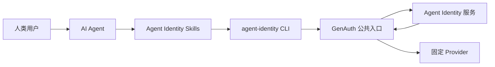

# Agent Identity Skills

面向人类用户和 AI Agent 的 Agent Identity 操作手册。这组 Skills 与
[`agent-identity` CLI](../genauth-agent-cli) 配套使用，覆盖用户池登录、公司级
Agent 创建与审批、Agent 设置、Credential、用户授权、Token 以及通过 GenAuth
调用固定 Provider 的完整闭环。

> Skills 是决策、编排和安全规则层；CLI 是唯一执行层。只安装 Skills、没有
> `agent-identity` CLI，无法完成任何真实操作。

[快速开始](#安装与快速开始) · [AI Agent 使用方式](#快速开始ai-agent) ·
[完整用户旅程](#完整用户旅程) · [Skills 列表](#skills-列表) ·
[认证与角色](#认证用户池与多角色-profile) · [安全](#安全边界与风险提示) ·
[开发与发布](#开发验证与发布)

## 这是什么？

Agent Identity Skills 将自然语言意图转换为受约束的 `agent-identity` CLI
操作。它们解决的是“应该由谁、在什么用户池、以什么顺序、使用哪些权限进行
操作”，CLI 负责参数校验、本地身份、密钥链、结构化输出以及向 GenAuth 发起
请求。



任何 Skill 都不得绕过 CLI 直接调用 Agent Identity 私有接口、Provider 主机、
数据库、EAK Delegation 或 Token Vault。

## 核心能力

| 能力 | 说明 |
| --- | --- |
| 身份与用户池 | 支持租户成员和租户管理员登录；两种身份都必须选择用户池 |
| 多角色 Profile | owner/requester、approver、admin、member 使用独立命名 Profile |
| 权限发现 | 从 GenAuth 查询 DataPolicy，Agent Identity 仅保存权限快照 |
| Agent 管理 | 创建和管理公司级 Agent、Capability、生命周期和 readiness |
| 审批 | Capability 和 Agent 设置分别提交、冻结版本并由其他管理员审批 |
| Agent 设置 | 控制显式/静默授权策略、Token TTL、UserGrant TTL、Credential TTL、redirect URI 等 |
| Credential | 创建、轮换、吊销；秘密默认保存在操作系统密钥链 |
| 用户授权 | 成员仅能显式授权自己；管理员可为指定用户发起显式或策略允许的静默授权 |
| Token | 由 Agent Identity 签发短期 Agent Token，默认不输出原始 Token |
| Provider 调用 | CLI 获取 Token 后只通过 GenAuth 调用部署好的固定 Provider 路由 |
| 撤销与诊断 | 撤销 Credential、UserGrant、Token JTI，并按层定位失败原因 |

当前只支持公司级 Agent，不创建个人 Agent。授权策略只配置在 Agent 自身，暂不
提供用户池级 Agent 策略。

## CLI 与 Skills 如何配合

一次典型操作会经过三层：

1. 用户用自然语言告诉 AI Agent 目标，例如“创建一个订单 Agent，并申请
   `orders.read` 权限”。
2. Skill 判断角色、用户池、审批边界、必要确认和恢复方式，并生成正确的 CLI
   调用。
3. CLI 使用本地 Profile 和操作系统密钥链，通过 GenAuth 完成真实请求，并返回
  稳定的 JSON 结果。

如果不使用 AI Agent，也可以由人类直接执行 README 中的 CLI 命令。此时仍应
遵守相同的角色、审批和秘密处理规则。

## 安装与快速开始

### 环境要求

- macOS arm64/x64、Linux arm64/x64 或 Windows x64。
- Node.js 与 npm，用于安装预构建 CLI 和 Skills。
- 一个可访问的 GenAuth HTTPS 地址、OIDC Client ID 和目标用户池 ID。
- 需要执行审批时，准备两个不同的真实身份：requester/owner 与 approver。

### 第一步：安装 CLI

终端用户推荐通过 npm 安装：

```bash
npm install --global @authing/agent-identity-cli
agent-identity version
agent-identity --help
```

不要使用 `npm install --omit=optional`，平台二进制通过 optional dependency
选择。源码开发者可在相邻的 `genauth-agent-cli` 仓库执行：

```bash
make install
agent-identity version
```

CLI 验证结果必须包含：

```json
{
  "api_version": "agent-identity.cli/v1",
  "kind": "Version",
  "data": {
    "server_contract": "genauth-agent-identity-v1"
  }
}
```

### 第二步：安装 Skills

GitHub 仓库发布后，可参考 Lark Skills 的方式全局安装。将
`<github-owner>` 替换为真实 GitHub owner：

```bash
npx skills add <github-owner>/genauth-agent-skill -y -g
```

从本地源码安装：

```bash
npx skills add /absolute/path/to/genauth-agent-skill -y -g
```

查看可安装的 Skill，不进行安装：

```bash
npx skills add /absolute/path/to/genauth-agent-skill --list
```

查看全局安装结果：

```bash
npx skills list -g
```

本仓库应发现 13 个 `agent-identity-*` Skills。安装或更新后，请启动一个新的 AI
Agent 会话，使 Skill 发现结果重新加载。

Codex 也可以使用符号链接安装。每个链接都必须指向本仓库对应目录，不能指向
Agent Identity 服务仓库：

```bash
mkdir -p "$HOME/.codex/skills"
ln -s /absolute/path/to/genauth-agent-skill/agent-identity-user-journey \
  "$HOME/.codex/skills/agent-identity-user-journey"
```

使用 `npx skills add` 可以一次安装全部 Skills，通常比手工逐个创建链接更方便。

### 第三步：验证环境

```bash
agent-identity version --output json --non-interactive
agent-identity doctor --output json --non-interactive
```

`doctor` 是只读检查，验证本地 Profile、用户池、操作系统密钥链和 GenAuth
连通性。它不代表某个 Agent 已经具备运行条件。

## 快速开始（AI Agent）

> 以下步骤面向使用 Codex、Claude Code 或其他支持 Skills 的 AI Agent。登录、
> 审批和显式授权页面需要真实人类参与，AI 不得代填密码或代替用户确认权限。

### 第一步：检查 CLI 和 Skills

在新会话中输入：

```text
请使用 agent-identity-setup Skill，检查 CLI 版本、server contract、Skill 安装、
Profile、用户池和密钥链状态。只做只读检查。
```

### 第二步：登录

租户成员登录示例：

```text
请使用 agent-identity-login Skill，以成员身份登录 GenAuth。
用户池是 <user-pool-id>，Client ID 是 <client-id>，Profile 名称使用 agent-owner。
```

租户管理员登录示例：

```text
请使用 agent-identity-login Skill，以租户管理员身份登录 GenAuth。
用户池是 <user-pool-id>，Client ID 是 <client-id>，Profile 名称使用 agent-approver。
```

AI Agent 会返回 GenAuth 登录地址或打开浏览器。用户完成登录后，必须通过
`auth status` 再次验证身份类型和用户池；出现登录 URL 不代表已经登录成功。

### 第三步：执行完整闭环

```text
请使用 agent-identity-user-journey Skill 完成整个流程：
- 使用 agent-owner 创建公司级 Agent
- Agent identifier：orders_agent
- application ID：<application-id>
- audience：https://api.example.com/orders
- 权限：先查询并让我确认 orders.read 对应的 DataPolicy ID
- 使用 agent-approver 审批 Capability 和 Agent 设置
- 授权模式使用 explicit-only，Token TTL 10 分钟
- 授权当前成员本人
- 最终通过 GenAuth 调用固定 Provider orders 的 GET /orders

每一步都输出非敏感 checkpoint；遇到登录、审批、授权或安全范围扩大时暂停让我确认。
```

这个 Skill 会从当前服务器状态继续执行。流程中断后，不应从头重复创建 Agent 或
授权请求。

## 认证、用户池与多角色 Profile

### 成员登录

```bash
agent-identity auth login \
  --profile-name agent-owner \
  --endpoint <genauth-https-origin> \
  --user-pool-id <user-pool-id> \
  --client-id <oidc-client-id>
```

成员只能以本人身份进行显式用户授权，不能指定其他用户，也不能申请静默授权。

### 租户管理员登录

```bash
agent-identity auth login \
  --profile-name agent-approver \
  --admin \
  --endpoint <genauth-https-origin> \
  --user-pool-id <user-pool-id> \
  --client-id <oidc-client-id>
```

租户管理员也必须选择用户池。管理员切换用户池必须经过服务端验证：

```bash
agent-identity --profile agent-approver auth switch-user-pool \
  --user-pool-id <user-pool-id>
```

### 推荐 Profile

| Profile | 角色 | 主要职责 |
| --- | --- | --- |
| `agent-owner` | 成员或管理员 | 创建 Agent、维护 Capability 和设置、创建 Credential |
| `agent-approver` | 另一位租户管理员 | 审批或拒绝 Capability/设置变更 |
| `agent-admin` | 租户管理员 | 为指定用户发起授权，或发起策略允许的静默授权 |
| `agent-user-<label>` | 租户成员 | 以本人身份完成显式授权 |

同一旅程中的 Profile 必须选择同一个用户池。owner/requester 不能审批自己的请求。
多角色自动化必须在每条命令中显式传入 `--profile`，不要依赖可变的默认 Profile。

```bash
agent-identity --profile agent-owner auth status --output json --non-interactive
agent-identity --profile agent-approver auth status --output json --non-interactive
```

## Skills 列表

### 推荐入口

| Skill | 什么时候使用 |
| --- | --- |
| [`agent-identity-setup`](agent-identity-setup/SKILL.md) | 首次安装、升级后或环境未知时，检查 CLI、契约、Profile、用户池和密钥链 |
| [`agent-identity-user-journey`](agent-identity-user-journey/SKILL.md) | 从登录一直完成到 Provider 调用，或从中断状态恢复整个闭环 |
| [`agent-identity-login`](agent-identity-login/SKILL.md) | 只需要登录、选择身份和用户池 |
| [`agent-identity-create-agent`](agent-identity-create-agent/SKILL.md) | 查询权限、创建公司 Agent 并提交 Capability 审批 |
| [`agent-identity-approve-agent`](agent-identity-approve-agent/SKILL.md) | 使用独立管理员审查并决定 Capability 或设置审批 |
| [`agent-identity-authorize-user`](agent-identity-authorize-user/SKILL.md) | 为成员本人或管理员指定的用户创建授权并等待 UserGrant |
| [`agent-identity-call-provider`](agent-identity-call-provider/SKILL.md) | 使用 Credential 与 UserGrant 通过 GenAuth 调用固定 Provider |
| [`agent-identity-revoke-access`](agent-identity-revoke-access/SKILL.md) | 精确撤销 Credential、UserGrant 或 Token JTI |
| [`agent-identity-diagnose`](agent-identity-diagnose/SKILL.md) | 只读定位 Profile、readiness、授权、Token、网关或 Provider 故障 |

### 组合基础

这些 Skills 通常由入口 Skill 自动组合。除非在开发或排障，不需要用户直接指定：

| Skill | 作用 |
| --- | --- |
| [`agent-identity-shared`](agent-identity-shared/SKILL.md) | 公共信任边界、JSON 契约、退出码、秘密处理和恢复规则 |
| [`agent-identity-auth`](agent-identity-auth/SKILL.md) | 登录、Profile、用户池和会话生命周期 |
| [`agent-identity-agent-management`](agent-identity-agent-management/SKILL.md) | 权限、公司 Agent、Capability、设置、审批和 readiness |
| [`agent-identity-authorization-runtime`](agent-identity-authorization-runtime/SKILL.md) | Credential、AuthorizationRequest、UserGrant、Token 和 Provider 调用 |

入口 Skills 保持简洁是有意设计：它们负责识别用户意图，完整的安全约束集中在
共享和领域 Skills 中，避免不同入口出现不一致规则。

## 完整用户旅程

| 阶段 | 执行角色 | 关键操作 | 完成证据 |
| --- | --- | --- | --- |
| 1. 身份上下文 | owner、approver、用户 | 登录并验证相同用户池 | Profile、subject、login type、selected user pool |
| 2. 权限与 Agent | owner | 查询 DataPolicy，创建公司 Agent | Agent ID、Capability draft version |
| 3. Capability 审批 | owner → approver | 提交冻结版本，由其他管理员审批 | approval ID/version、active Capability |
| 4. Agent 设置 | owner → approver | 配置授权模式和 TTL，必要时审批 | effective settings 和版本 |
| 5. Credential | owner | 在 readiness 只剩 `credential_required` 时创建 | credential ID、Keychain ref、无 readiness blocker |
| 6. 用户授权 | member 或 admin | 显式/策略允许的静默授权 | `APPROVED` AuthorizationRequest、active UserGrant |
| 7. Provider 调用 | runtime profile | CLI 内存中获取 Token，经 GenAuth 调固定 Provider | ProviderResponse 和 request ID |

审批成功不等于 Agent 已可运行；授权页面完成也不等于 UserGrant 已建立。Skill 会在
每一步重新读取服务器状态，而不是根据上一条写入命令猜测结果。

## 常用 CLI 操作

### 查询权限并创建 Agent

```bash
agent-identity --profile agent-owner permissions list \
  --audience <audience> --output json --non-interactive

agent-identity --profile agent-owner agents create \
  --identifier <stable-id> \
  --display-name <display-name> \
  --description <purpose> \
  --application-id <application-id> \
  --audience <audience> \
  --permission-id <data-policy-id> \
  --output json --non-interactive
```

管理员代创建时必须提供 `--owner-user-id`；成员创建时省略该参数，服务端绑定当前
成员。创建输入示例见
[`company-agent.json`](agent-identity-user-journey/examples/company-agent.json)。

### 提交和审批 Capability

```bash
agent-identity --profile agent-owner agents submit \
  --agent-id <agent-id> --version <draft-version> \
  --output json --non-interactive

agent-identity --profile agent-approver approvals get \
  --approval-id <approval-id> --output json --non-interactive

agent-identity --profile agent-approver approvals approve \
  --approval-id <approval-id> \
  --version <approval-version> \
  --reason <reason> --yes \
  --output json --non-interactive
```

### 配置 Agent 设置

```bash
agent-identity --profile agent-owner agents settings update \
  --agent-id <agent-id> \
  --file <complete-settings.json> \
  --output json --non-interactive
```

完整输入结构见
[`agent-settings.json`](agent-identity-user-journey/examples/agent-settings.json)。
启用静默授权、延长 Token/UserGrant TTL、扩大 redirect URI 或关闭实时决策都属于
安全范围扩大，需要明确确认，部分变更还需要独立审批。

### 发起显式用户授权

```bash
agent-identity --profile <authorization-profile> authorizations create \
  --agent-id <agent-id> \
  --audience <audience> \
  --permission-id <data-policy-id> \
  --mode explicit \
  --output json --non-interactive

agent-identity --profile <authorization-profile> --timeout 10m \
  authorizations wait \
  --authorization-id <authorization-id> \
  --output json --non-interactive
```

管理员为指定用户发起授权时可增加 `--user-id <target-user-id>`。成员不得增加
这个参数。返回的 `authorization_url` 只能交给目标用户本人，由 GenAuth 展示
Agent、权限和有效期并完成登录与确认。

### 调用固定 Provider

```bash
agent-identity --profile <runtime-profile> api call \
  --credential keychain://agent-identity/credential/<credential-id> \
  --grant-id <user-grant-id> \
  --audience <audience> \
  --provider <fixed-provider-key> \
  --method GET \
  --path /resource/path \
  --output json --non-interactive
```

`api call` 是推荐路径：Token 只存在于 CLI 进程中，并只发送回 GenAuth。不得添加
任意 `--url`、`--host`、Authorization/Cookie 或可信 GenAuth 请求头。

## JSON 输出契约

自动化命令必须使用 `--output json --non-interactive`，只读取 stdout 中稳定的
JSON 字段，不解析表格、进度文本或 debug 日志。

成功：

```json
{
  "api_version": "agent-identity.cli/v1",
  "kind": "Agent",
  "data": {},
  "request_id": "server-request-id",
  "warnings": []
}
```

失败：

```json
{
  "api_version": "agent-identity.cli/v1",
  "error": {
    "code": "STABLE_ERROR_CODE",
    "message": "human-readable message",
    "remediation": {}
  },
  "request_id": "server-request-id"
}
```

| 退出码 | 含义 |
| --- | --- |
| `2` | 参数无效或输入歧义 |
| `3` | 登录、会话或本地 Credential 不可用 |
| `4` | 权限拒绝或用户拒绝 |
| `5` | 状态不匹配或资源不存在 |
| `6` | 请求仍在等待，不代表成功 |
| `7` | 可重试依赖错误；写入只能保留同一幂等上下文重试 |
| `8` | 版本冲突；重新读取服务器版本，不得本地自增 |
| `9` | 内部或本地安全设施失败 |

## 安全边界与风险提示

这组 Skills 能够以用户或管理员身份创建 Agent、审批权限、授权用户和访问下游
业务数据。AI Agent 仍可能理解错误或选择错误目标，使用前必须确认以下规则：

- 所有请求只通过 `agent-identity` CLI 进入 GenAuth。
- GenAuth 是公共入口和 Provider 转发层；Agent Identity 管理授权状态并签发
  Agent Token。
- DataPolicy 的权威状态属于 GenAuth；Agent Identity 只保存快照，不将其改名为
  OAuth scope。
- owner/requester 永远不能审批自己的请求。
- 成员只能显式授权自己；不能指定其他用户或申请静默授权。
- 静默授权必须同时满足 Agent 设置、GenAuth 决策和管理员明确确认。
- Session Token、Client Secret、PKCE verifier、authorization code 和完整 Agent
  Token 不得写入聊天、日志、文件、Skill 输出或长期环境变量。
- Credential secret 默认存入 OS Keychain。只保留 `credential_id` 和
  `keychain://` 引用，不读取引用背后的值。
- 默认使用 `api call`。只有调用方明确需要原子 Token 操作时才使用
  `tokens issue`，默认不带 `--show-token`。
- 删除 Agent 不可逆；暂停、撤销 Grant、撤销 Credential 和撤销 Token 必须根据
  用户要求选择最小影响范围。

详细规则见
[`agent-identity-shared`](agent-identity-shared/SKILL.md) 及其
[`automation-contract`](agent-identity-shared/references/automation-contract.md) 和
[`lifecycle-and-recovery`](agent-identity-shared/references/lifecycle-and-recovery.md)。

## 诊断与恢复

基础检查：

```bash
agent-identity version --output json --non-interactive
agent-identity --profile <profile> doctor --output json --non-interactive
agent-identity --profile <profile> auth status --output json --non-interactive
```

让 AI Agent 执行只读诊断：

```text
请使用 agent-identity-diagnose Skill，只读检查当前 Profile、用户池、Agent
readiness、Credential、AuthorizationRequest、UserGrant、Token、GenAuth 网关和
Provider，找出第一个失败层。不要审批、重提、轮换或撤销任何资源。
```

诊断顺序为：CLI contract → Profile/用户池 → Agent/Capability/设置/readiness →
Credential → AuthorizationRequest/UserGrant → Token → GenAuth 决策与网关 →
Provider → audit。中断后先读取当前服务器状态，再从未完成阶段继续，不能把全部
写入从头执行一遍。

## 仓库结构

```text
genauth-agent-skill/
├── agent-identity-shared/                 # 公共安全与自动化契约
├── agent-identity-auth/                   # 登录与 Profile
├── agent-identity-agent-management/       # Agent、权限、设置和审批
├── agent-identity-authorization-runtime/  # Credential、授权、Token、Provider
├── agent-identity-user-journey/           # 七阶段完整闭环
├── agent-identity-setup/                  # 安装与环境验证
├── agent-identity-*/                      # 用户意图入口 Skills
├── scripts/verify-cli-contract.sh         # CLI–Skill 契约检查
└── .gitlab-ci.yml                         # GitLab 到 GitHub 同步
```

## 开发、验证与发布

### CLI–Skill 契约检查

每次增加或修改 Skill 中的 CLI 命令，都必须对当前 CLI 运行：

```bash
AGENT_IDENTITY_CLI=/path/to/agent-identity \
  ./scripts/verify-cli-contract.sh
```

检查内容包括：

- CLI API version 和 server contract。
- 所有 Skill 使用的命令是否存在。
- 审批、静默授权、轮换、撤销等敏感操作是否仍有必要参数和 `--yes`。
- Skill frontmatter 名称是否与目录一致。
- Skill 中是否出现绕过 CLI 的 Agent Identity/Runtime API 调用。

该检查不登录、不访问业务资源，也不修改远端状态。

### GitLab CI 推送 GitHub

仓库中的 [`.gitlab-ci.yml`](.gitlab-ci.yml) 会在 GitLab 默认分支或 Tag
Pipeline 中，将相同 commit/Tag 推送到 GitHub。任务通过进程级 Git HTTP
Authorization Header 使用 Token；Token 不会写入 remote URL 或仓库配置，并且
永远不 force push。

在 GitLab **Settings > CI/CD > Variables** 配置：

| 变量 | 要求 |
| --- | --- |
| `GITHUB_TOKEN` | Masked、Protected；目标仓库 `Contents: Read and write` |
| `AGENT_SKILL_GITHUB_REPOSITORY` | `owner/repository` 格式，不包含 URL 或 `.git` |
| `GITHUB_TARGET_BRANCH` | 可选；未设置时使用 GitLab 默认分支名 |

GitLab 默认分支和需要同步的 Tag pattern 也应设为 Protected，否则 protected
变量不会注入任务。如果 GitHub 已存在分叉分支或冲突 Tag，任务会失败并要求人工
处理，不会覆盖 GitHub 历史。

## 相关项目

- [`genauth-agent-cli`](../genauth-agent-cli)：用户和 AI Agent 实际执行命令的 CLI。
- Agent Identity 服务：保存 Agent、Capability、设置、Credential、授权与 Token
  状态，并负责签发 Agent Token。
- GenAuth：唯一公共入口、DataPolicy 权威来源和固定 Provider 转发层。
